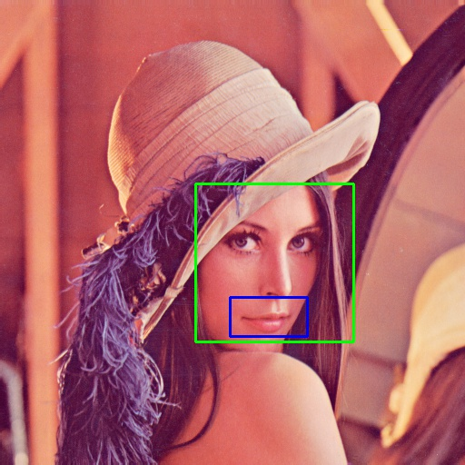
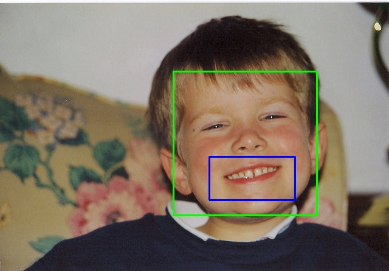
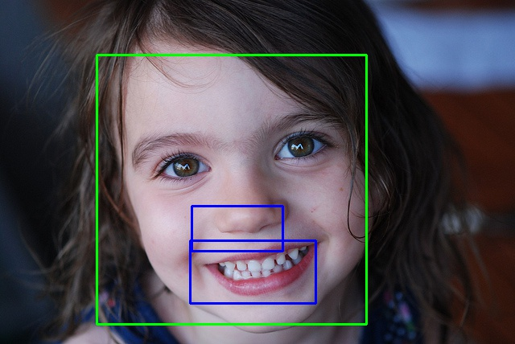

smile-face-detector
===================

smile-face-detector detects smiles in your image. 





# How to install 

```
$ npm install smile-face-detector --save
```

# example code

```js
const SmileFaceDetector = require('../.');
const detector = new SmileFaceDetector({smileScale: 1.01, smileNeighbor: 10});
detector.on('error', (error) => {
  console.error(error);
});
detector.on('face', (faces, image) => {
  console.log(faces);
  faces.forEach((face) => {
    // write rectangle
    image.rectangle([face.x, face.y], [face.width, face.height], SmileFaceDetector.green, 2);
  });
});
detector.on('smile', (smiles, face, image) => {
  console.log(smiles);
  smiles.forEach((smile) => {
    image.rectangle([smile.x + face.x, smile.y + face.y/2 + face.y], [smile.width, smile.height], SmileFaceDetector.blue, 2);
  });
  image.save('./images/Lenna_result.jpg');
});
detector.load('./images/Lenna.png').then((image) => {
  detector.detect(image);
}).catch((e) => {
  console.error(e);
});
```

# API

## constructor

```js
new SmileFaceDetector({
  // Parameter specifying how much the image size is reduced at each image scale on face detection
  faceScale: 1.01,
  // Parameter specifying how many neighbors each candidate rectangle should have to retain it on face detection
  faceNeighbor: 2,
  // Parameter specifying how much the image size is reduced at each image scale on smile detection
  smileScale: 1.01,
  // Parameter specifying how many neighbors each candidate rectangle should have to retain it on smile detection
  smileNeighbor: 2,
});
```
